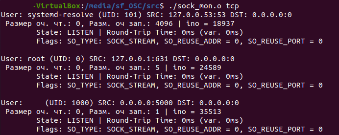
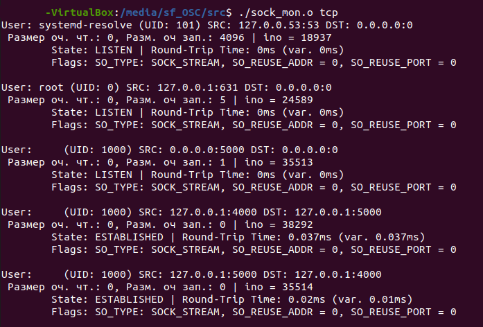

# socket-monitor
Socket Monitoring using Netlink. Shows active sockets with additional info. Adds inode number to the info extracted from kernel space, which is later shown in userland (as `ino`).

## Structure

Source code is located in the `src` folder.

1. `kern.c` and `Makefile_kern` are the kernel space module and Makefile for compiling. After compiling the kernel module needs to be loaded with `insmod` as usual.
2. `sock_mon.c` and `Makefile_mon` are the userland program and the corresponding Makefile.

Usage:

* `./sock_mon.o tcp` - shows info about TCP sockets.
* `./sock_mon.o udp` - shows info about UDP sockets.


## Screenshots

### Simple scenario

TCP and UDP.


### Communicating TCP sockets

First a listen socket was created with:

`nc -l 5000`



Then a client socket connected to the created listen socket:

`nc −C localhost 5000 −p 4000`



As one can note, both sockets at 4000 and 5000 are in `ESTABLISHED` state now.

Killing the server socket will result in the client switching into `CLOSED` state:

```sudo kill −9 `sudo lsof −t −i:5000` ```